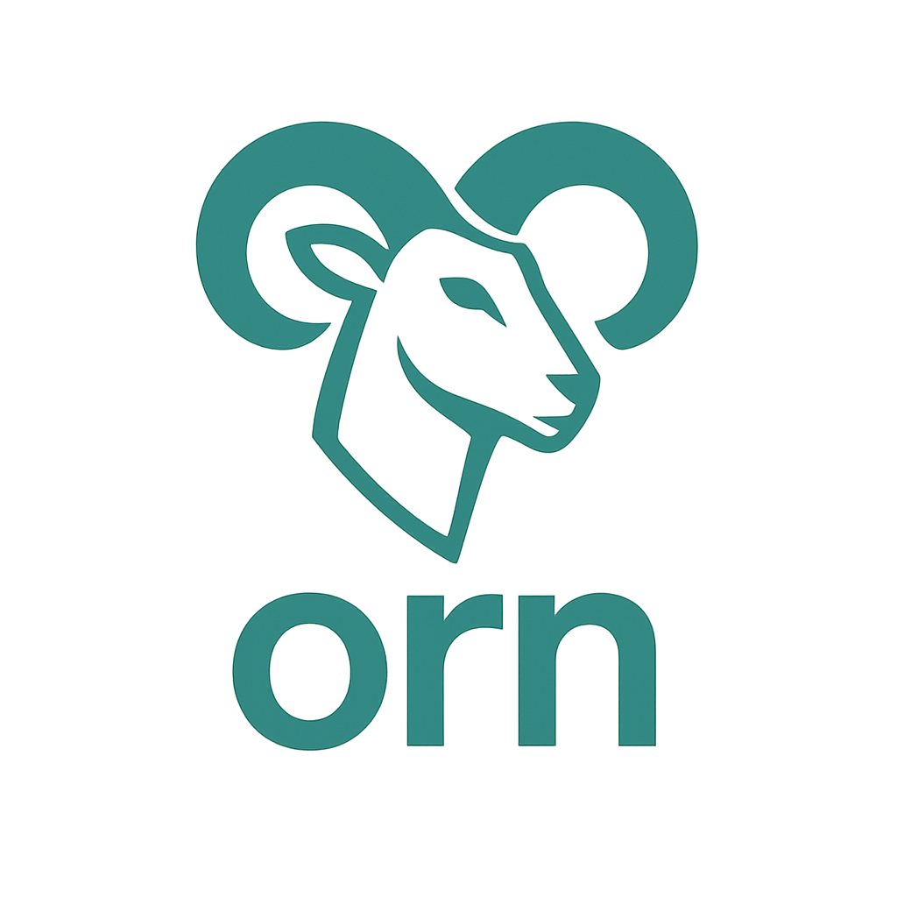

# Orn

	

Orn is a sketching systems language.

## Introduction

Orn is a systems-oriented language that aims for minimal syntax while preserving
maximun expressiveness.

Take a look at the [Orn Book](https://pabloosabaterr.github.io/Orn-rework/)
for documentation about Orn.
