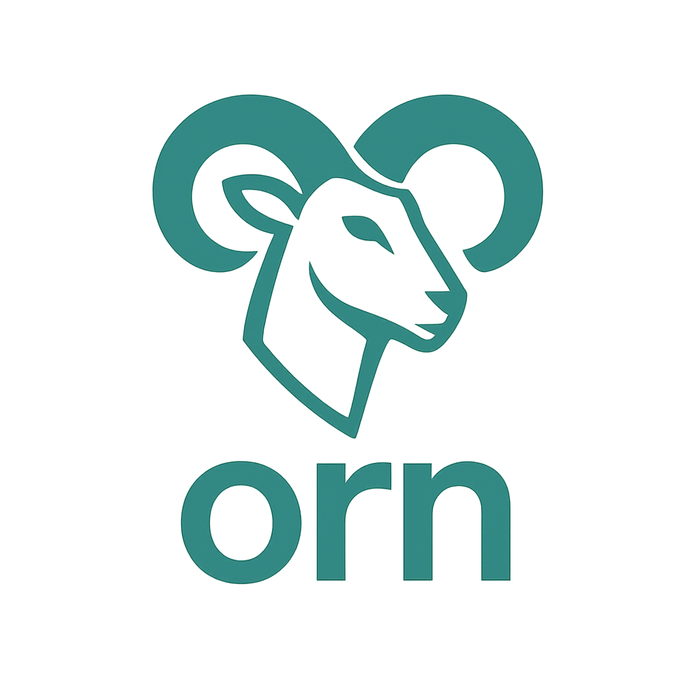

# Orn

<p align="center">
	
</p>

Orn is a systems language where every type is a range.

There are no built-in types. A value is described by the set of integers it can
hold, and the compiler tracks that set through the program:

```
u8 :: 0..255;

classify :: (i: 0..1000) 0..2 {
    if i < 10 {
        0       // here i : 0..9
    } else {
        1       // here i : 10..1000
    }
};

// wrong
sum :: (a: u8, b: u8) u8 {
    a + b       // error: 0..510 does not fit in 0..255
};

// saturating
sum_sat :: (a: u8, b: u8) u8 {
    a + b in u8 else { 255 }
};

// wrapping, once the standard library has generics
sum_wrap :: (a: u8, b: u8) u8 {
    wrap(a + b, u8)
};
```

- Names like `u8` or `bool` are plain aliases from the standard library.
- Arithmetic never overflows silently: the result range must fit.
- Comparisons narrow ranges at compile time, with no runtime cost.
- Storage is fixed by the declared range; narrowing only exists in the analysis.

Orn is in an early stage. See the [Orn Book](https://pabloosabaterr.github.io/Orn-rework/)
for the grammar and the current design.

## Building

```
make
make test
```
